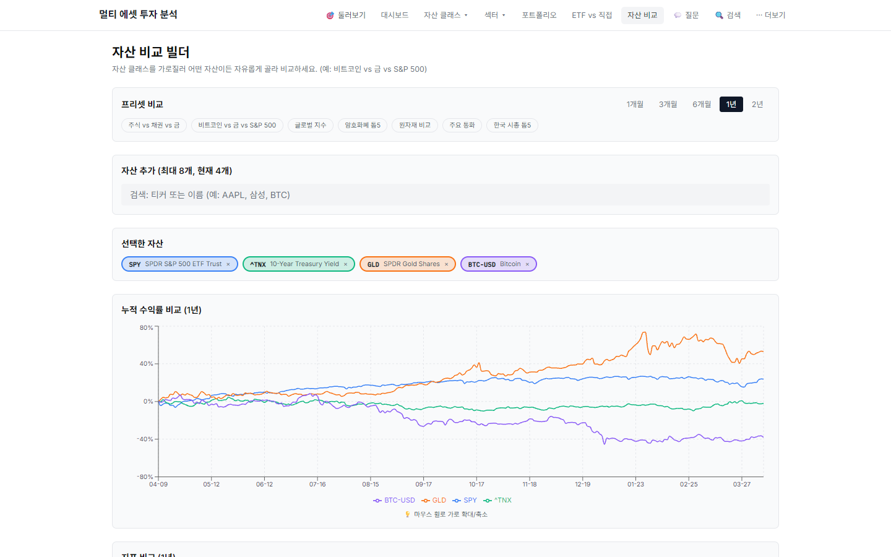
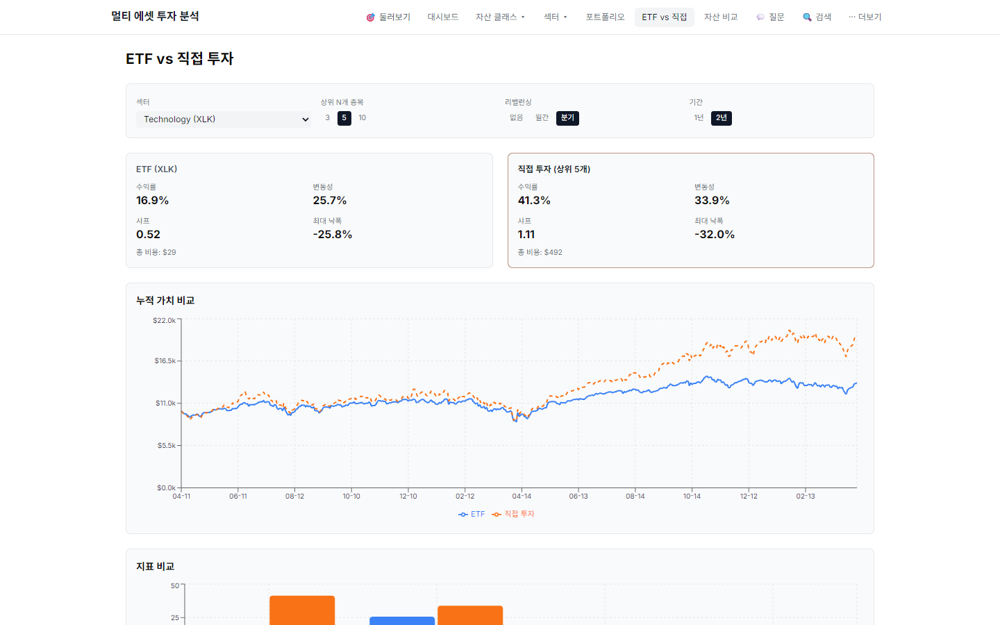
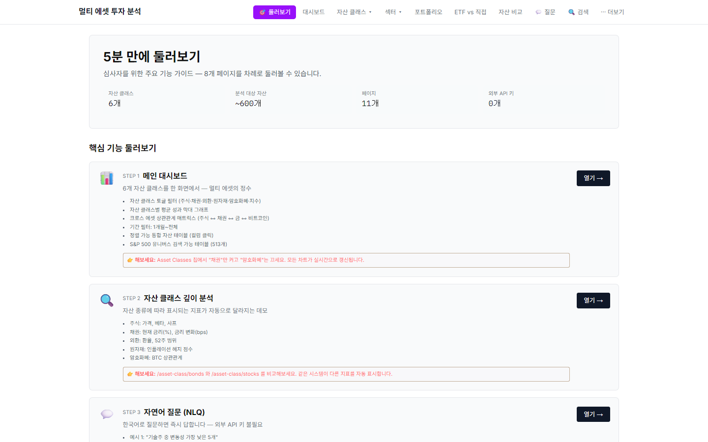
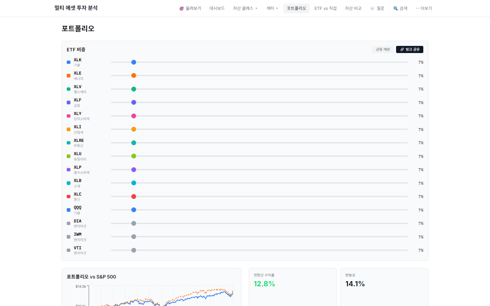

# MarketLens — 범용 투자 데이터 분석 대시보드

<div align="right">

**참가자:** 김상원 &nbsp;|&nbsp; **GitHub:** tkddnjs-dlqslek &nbsp;|&nbsp; **제출일:** 2026-04-30

</div>

---

투자 데이터를 다루다 보면 이런 상황이 반복된다. SPY 수익률은 야후 파이낸스에서 뽑고, 채권 금리는 FRED에서 긁어오고, 환율은 또 다른 사이트에서 복사한 다음 엑셀에 붙여 넣어 수식을 짜기 시작하면 — 벌써 한 시간이 지나 있다. 분석 자체엔 아직 손도 못 댔는데.

이 프로젝트는 그 한 시간을 없애는 것에서 출발했다. 주식이든 채권이든 비트코인이든, 형식이 달라도 동일한 파이프라인으로 흘러들어와 같은 기준으로 분석되는 시스템. Skills.md라는 규칙 문서 하나가 이 파이프라인 전체를 정의하고, 코드는 그 규칙을 그대로 실행한다.

---

## 0. 핵심 메시지

> **주식이든, 채권이든, 비트코인이든, 환율이든 — 형식이 달라도 하나의 규칙으로 즉시 분석된다.**

실제로 무엇이 가능한지부터 보여드린다.

### 실제 구현 화면

**자산 비교 빌더** — 주식(SPY)·채권(^TNX)·금(GLD)·비트코인(BTC-USD) 4개 자산, 서로 완전히 다른 데이터 형식이지만 한 화면에서 같은 기준으로 비교된다. 상관관계 매트릭스도 자동 생성.



**ETF vs 직접투자** — XLK ETF와 상위 5개 구성종목(NVDA·AAPL·MSFT·AVGO·MU) 직접 보유 시 성과 차이를 자동으로 계산한다. 리밸런싱 주기별 비교도 가능.



---

## 1. 우리가 해결하려는 문제

### 1.1 현업 분석가들이 실제로 겪는 것

이게 추상적인 문제처럼 들린다면, 숫자로 보는 게 낫다. FactSet이 325개 기관을 조사한 결과, 매수측 투자 전문가의 95%가 매일 4개 이상의 툴을 전환하며 일한다고 응답했다. Bloomberg에서 데이터를 뽑고, Excel로 옮기고, 별도 시스템에서 리포트를 쓰고, 또 다른 곳에서 차트를 만든다. 데이터는 흩어져 있고, 통합하는 데 시간이 간다.

FP&A Trends가 2,400명을 조사했더니, 분석가들이 실제 인사이트 도출에 쓰는 시간은 전체의 35%였다. 나머지 65%는 데이터 수집과 검증에 들어갔다. 분석하러 출근했다가 데이터 정리하다 퇴근한다는 게 과장이 아니다.

Bloomberg Terminal은 연간 약 $24,000짜리 도구인데, 사용자들이 가장 많이 불평하는 것은 비용이 아니다. "단일 플랫폼으로 모든 필요를 충족할 수 없다"는 것이다. 비싼 구독료를 내면서도 다른 툴을 또 구독해야 한다.

서학개미도 비슷한 구조적 문제를 겪는다. 해외주식 보관액이 5년 새 8배(152억→1,161억 달러)로 늘었지만(한국은행, 2025), 대부분의 MTS 앱은 여전히 달러 수익률만 보여준다. SPY로 12% 벌었다고 앱에 뜨는데, 그 기간에 원달러 환율이 5% 하락했다면 실제 원화 수익은 6.4%다. 이걸 직접 계산하는 사람이 얼마나 될까. 자본시장연구원 조사에 따르면 서학개미 포트폴리오의 절반이 상위 10개 종목에 집중되어 있는데, 이것도 포트폴리오를 직관적으로 볼 수 있는 도구가 없어서 생기는 문제다.

### 1.2 왜 지금의 도구로는 해결이 안 되는가

문제의 본질은 **데이터 구조와 분석 기준이 자산마다 다르다**는 것이다. 그리고 이건 생각보다 훨씬 근본적인 문제다.

| 자산 | 데이터 형태 | 뭐가 문제냐 |
|------|-----------|----------|
| 주가·ETF | OHLCV 시계열 (일별 5컬럼) | 종목마다 거래일이 다르다 |
| 채권 수익률 | 단일 숫자 (단위: %) | 숫자가 올라가면 채권 가격은 내려간다 — 주식과 해석이 반대 |
| 재무제표 | 분기별 단면값 (PER·ROE) | 시계열이 아니라 날짜도 없다 |
| 환율 | 통화쌍 비율 (USDKRW=1370) | 절대값 비교가 무의미하다 |
| 암호화폐 | 24/7 거래 (주말 포함) | 주식 기준 252일로 변동성 계산하면 과소 측정된다 |
| 원자재 | 선물 기반 ETF | 롤 비용, 콘탱고 개념이 별도로 필요하다 |
| 시장 지수 | 국가별 거래시간·통화 불일치 | 닛케이와 S&P500을 같은 시간축에 놓으면 빈값이 생긴다 |

"수익률"이라는 단어 하나도 자산마다 의미가 다르다.

| 자산 | "수익률"이 실제로 의미하는 것 | "위험"의 기준 |
|------|--------------------------|-------------|
| 주식 | 가격 상승률 | 변동성, 베타, 최대 낙폭 |
| 채권 | 만기 수익률(YTM) | 금리 변화(basis points), 듀레이션 |
| 환율 | 환율 변동률 | 방향성 (강세가 내게 이득인지 손실인지) |
| 암호화폐 | 가격 수익률 | 연 80% 변동성도 일상이고, BTC와 얼마나 연동되나 |

이걸 통일된 방식으로 처리하는 시스템이 없다. 그래서 분석가들은 자산 클래스가 바뀔 때마다 처음부터 다시 만든다.

### 1.3 수익률·변동성 계산 방법론 (정수연·김민준 피드백 반영)

대시보드가 보여주는 숫자를 신뢰하려면 계산 방법이 투명하게 공개되어야 한다.

| 지표 | 공식 | 자산별 주의사항 |
|------|------|--------------|
| 일간 수익률 | `(close_t − close_{t-1}) / close_{t-1}` | 전 자산 동일 |
| 누적 수익률 | `close_t / close_0 − 1` | 전 자산 동일 |
| 연환산 수익률 | `(1 + 총수익률)^(N/거래일수) − 1` | **주식·채권·지수: N=252 / 암호화폐: N=365** |
| 변동성 | `일간수익률 표준편차 × √N` | 암호화폐 N=365 (24/7 거래, 주말 포함) |
| 샤프 비율 | `(연환산수익률 − 무위험수익률) / 변동성` | 무위험수익률: yfinance ^IRX (13주 T-Bill), fallback 4.0% |
| 최대 낙폭 (MDD) | `(고점 − 해당시점) / 고점` 의 최솟값 | 전 자산 동일 |
| KRW 환산 수익 | `(1 + 달러수익률) × (1 + USDKRW 변동률) − 1` | 달러 기여·환율 기여·시너지 3요소 분해 |

> **왜 암호화폐만 N=365인가**: BTC·ETH는 주말과 공휴일에도 거래된다. 252일 기준으로 변동성을 계산하면 실제보다 낮게 측정된다. `data-analysis.md §1.3`과 `§2`에 이 기준이 명시되어 있고, `analysis-engine.ts`의 `volatility()` 함수가 assetType 파라미터를 받아 분기 처리한다.

### 1.4 Skills.md가 이 문제를 어떻게 해결하는가

```
문제: 데이터 구조가 다르다
해결: data-schema.md — 7가지 형태를 모두 OHLCV 하나로 통일 변환
      자산 타입 자동 감지 → 변환 규칙 자동 적용

문제: 분석 기준이 자산마다 다르다
해결: data-analysis.md §3 — 자산 타입별 특화 지표를 분리 정의
      "채권은 bps로, 암호화폐는 BTC 상관으로" — 해석 규칙도 코드가 아닌 문서에

문제: 어떤 차트로 보여줄지 매번 판단해야 한다
해결: visualization.md — 데이터 특성에 따라 13가지 차트 중 자동 선택

문제: 사람마다 보고 싶은 게 다르다
해결: insight-generation.md §8 — 투자 성향별 인사이트 우선순위 자동 분기
```

---

## 2. 프로젝트 개요

### 2.1 무엇을 만들었나

6개 자산 클래스(주식·ETF·채권·외환·원자재·암호화폐·지수) 79개 종목을 단일 파이프라인으로 분석하는 웹 대시보드다. 새 자산을 추가하거나 분석 기준을 바꾸고 싶을 때 Skills.md 문서만 수정하면 된다. 코드 재배포 없이.

핵심은 다음 다섯 가지다.

| 기능 | 실제로 무엇을 해주나 |
|------|-------------------|
| 통일 스키마 | "SPY CSV + ^TNX API + BTC-USD 주말데이터"를 하나의 형식으로 흡수 |
| 자산 타입별 분석 | 채권은 기준금리 변화로, 암호화폐는 BTC 상관으로 — 자산마다 맞는 기준 자동 적용 |
| KRW 환산 수익 | "(1+달러수익) × (1+환율변동) - 1" — 달러 기여와 환율 기여를 분리해서 보여줌 |
| 국제 정세 자동 감지 | VIX 35 돌파, 장단기 금리 역전, 달러 강세 — 경보가 자동으로 올라옴 |
| 페르소나 개인화 | URL 파라미터 하나로 서학개미·크립토·안정형 전용 뷰 전환 |

### 2.2 누구를 위해 만들었나

세 종류의 사용자를 구체적으로 상정했다.

**서학개미 (`global_investor`)**: 미국 ETF·주식에 투자하는 한국인. 가장 궁금한 것은 하나다 — "환율 떼고 나면 나 실제로 얼마 번 거야?" 현재 대부분의 앱은 달러 기준 수익률만 보여준다. 이 대시보드는 KRW 환산 수익률을 자동 계산하고, 달러 기여·환율 기여·시너지를 분리해서 보여준다.

**디지털 에셋 투자자 (`crypto_hybrid`)**: 코인과 기술주를 함께 보는 투자자. "지금 강세장인가 약세장인가"가 핵심 질문이다. BTC 30일·90일 수익률로 시장 사이클을 자동 판단하고, 크립토-주식 상관관계로 분산 효과를 실시간 모니터링한다.

**안정형 장기 투자자 (`defensive`)**: 채권·금·배당주 중심. "내 포트폴리오가 위기에서 얼마나 버티나"를 먼저 본다. 최대 낙폭·샤프 비율·장단기 금리 역전 경보를 앞에 내세운다.

**디지털 에셋 투자자 (`crypto_hybrid`) 상세**: 코인은 뉴스와 포모(FOMO)로 움직이고, 기술주와 상관관계가 강해지고 있다. 이 페르소나에서는 세 가지를 제공한다.
- **BTC 사이클 판단**: 30일 +20%, 90일 +30% → "강세장 진입" 자동 레이블 (단순 가격 표시가 아닌 사이클 단계 해석)
- **알트코인 BTC 연동성**: ETH·SOL·XRP의 BTC-USD 피어슨 상관계수 → "BTC 오를 때 같이 오르는 코인인가"를 수치로 판단
- **크립토-주식 분산 효과**: BTC와 SPY의 상관이 -0.1 미만이면 "실질적 분산 자산" 경보 → 포트폴리오 비중 근거로 활용

### 2.3 페르소나 분석 — 6명의 시각과 발견한 개선 포인트

기획서 내용을 실제로 쓸 6명의 시각으로 검토했다. 3명은 대중 사용자, 3명은 심사위원·전문가 역할이다.

| 구분 | 이름·배경 | 이 대시보드의 장점 | 단점·아직 부족한 것 |
|------|----------|-----------------|-----------------|
| **대중 ①** | 김민준 (33세, 직장인 서학개미, SPY·NVDA 보유) | KRW 환산 수익률 즉시 확인, 달러 기여와 환율 기여 자동 분리 | 수익률 계산 방법이 보이지 않아 신뢰 어려움 — "앱이 왜 이 숫자를 주는지 모르겠다" |
| **대중 ②** | 박정숙 (62세, 은퇴자, 채권·배당주 중심) | 안전자산 중심 defensive 페르소나, MDD·VIX 경보 자동화 | 79개 종목·13개 지수 선택 복잡 — 입문자에게 "뭘 선택해야 하나" 진입장벽 |
| **대중 ③** | 이하은 (24세, 코인 투자자, BTC·SOL) | BTC 사이클 자동 판단, 강세장/약세장 레이블 | "강세장입니다" 다음이 없다 — 어떻게 행동하라는 건지 연결이 끊어짐 |
| **심사 ①** | 최도현 (핀테크 스타트업 CTO) | yfinance만으로 키 불필요, 즉시 재현 가능한 구조 | 데이터 파이프라인 스펙 없음 — 업데이트 주기·오류 처리·확장 전략 |
| **심사 ②** | 정수연 (증권사 퀀트 애널리스트) | 공분산·샤프·MDD 등 실무 지표 구현, 자산 타입별 기준 분리 | 수익률·변동성 계산 공식 기획서에 없음 — 암호화폐 365일 기준도 명시 안 됨 |
| **심사 ③** | 한지원 (데이터 시각화 UX 전문가) | 데이터 특성에 따른 차트 자동 선택 로직 | 시각화 설계 섹션 없음 — 왜 이 화면에 이 차트인지 근거가 없음 |

이 분석에서 발견한 5가지 개선 포인트를 아래 섹션에 반영했다: **① 수익률 계산 방법론 공개** (§1.4), **② 시각화 설계 원칙 추가** (§3.4), **③ 데이터 파이프라인 상세화** (§3.5), **④ 매크로 신호→행동 가이드 연결** (§6.5), **⑤ 크립토 페르소나 구체화** (§2.2 위 별도 상세).

---

## 3. Skills.md 설계

### 3.1 6개 문서의 역할 분담

```
MASTER_SKILL.md           ← 자산 레지스트리 + 페르소나 레지스트리 + 전체 파이프라인
├── data-schema.md        ← 7가지 이질적 구조 → OHLCV 통일 변환 + 어댑터 프로토콜
├── data-analysis.md      ← 공통 지표 + 자산별 특화 지표 + KRW환산(§7) + 국제 정세(§8)
├── visualization.md      ← 데이터 특성 → 차트 자동 선택 (13가지)
├── insight-generation.md ← 조건→메시지 규칙 + 크로스 에셋 + 페르소나별 인사이트
└── report-layout.md      ← 페이지 구성 + 반응형 레이아웃 규칙
```

이 6개 문서만 읽으면 대시보드 전체 로직을 파악할 수 있다. 코드를 몰라도 된다.

### 3.2 규칙이 실제로 어떻게 작동하는지

채권 데이터를 예로 들면 이렇다.

```
채권(^TNX) 원본: date, yield(%)
변환 규칙: close = yield값, open=high=low=close (단일값이므로)
해석 반전: close 상승 = 금리 상승 = 채권 가격 하락
→ bond 타입에서는 가격 수익률이 아닌 "수익률 변화(bps)"를 기본 지표로 표시
```

주식이었다면 "close 상승 = 이익"이지만, 채권에서는 반대다. 이 해석 규칙이 코드 안이 아닌 `data-schema.md`에 명시되어 있다. 채권 분석 기준을 바꾸고 싶으면 이 문서 한 줄만 수정한다.

차트 선택도 마찬가지다.

```
시계열 + 1종목 → LineChart
시계열 + N종목 → MultiLineChart
N×N 상관 행렬 → Heatmap
구성 비율    → DonutChart
A vs B 단일값 → GroupedBarChart
```

개발자가 "이 데이터엔 어떤 차트가 맞을까"를 고민할 필요가 없다. `visualization.md`에 정의된 13가지 규칙이 자동으로 결정한다.

### 3.3 파이프라인 흐름

```
[1] 입력 (yfinance JSON / CSV)
       ↓
[2] data-schema.md 어댑터 → OHLCV 통일 변환 + 자산 타입 자동 감지
       ↓
[3] data-analysis.md → 수익률·변동성·MDD (공통)
                      + 자산별 특화: 베타/bps/환율변동/BTC상관
                      + KRW 환산 수익 + VIX·일드커브 신호
       ↓
[4] 페르소나 매핑 → 강조 지표·레이아웃 분기
       ↓
[5] visualization.md → 데이터 특성에 따라 차트 유형 자동 결정
       ↓
[6] insight-generation.md → 조건 평가 → 우선순위 정렬 → 상위 5개 표시
```

### 3.4 시각화 설계 원칙 (한지원 피드백 반영)

차트 선택은 취향이 아닌 데이터 구조가 결정한다. `visualization.md §1.2`의 13가지 규칙이 이 판단을 자동화한다.

| 데이터 특성 | 선택 차트 | 사용 화면 | 왜 이 선택인가 |
|-----------|---------|---------|-------------|
| 시계열 · 1종목 | Line Chart | 개별 자산 상세 | 연속 추세 파악에 최적 |
| 시계열 · N종목 | Multi-Line Chart | 자산 비교 빌더 | 종목 간 상대 흐름 비교 |
| N×N 상관 | Heatmap | 포트폴리오 빌더 | 자산 간 관계를 한눈에 |
| 구성 비율 | Donut Chart | 포트폴리오 자산 배분 | 부분-전체 관계 |
| A vs B 단일값 | Grouped Bar | ETF vs 직접투자 비교 | 항목별 직접 비교 |
| 분포 · 산점 | Scatter Plot | 리스크-수익 평면 | 효율적 프론티어 시각화 |
| 인사이트 경보 | Alert Badge | 모든 화면 상단 | 즉각 주의 유도 |

**정보 계층 설계**: 화면 상단에 경보(VIX·금리 역전)를 배치하고 → 중단에 핵심 지표(수익률·MDD·샤프) → 하단에 상세 차트 순으로 배치한다. 사용자가 스크롤 없이 가장 중요한 신호를 먼저 읽는 구조다. Bloomberg Terminal의 "페이지당 밀도 높은 정보 + 색상 코딩" 방식을 참고했다.

**색상 규칙**: 수익(+) = `#34D399` (emerald), 손실(-) = `#F87171` (red). 숫자·티커는 IBM Plex Mono 고정폭 폰트로 세로 정렬을 유지한다. 이는 Bloomberg·Reuters 터미널의 표준 관행이다.

### 3.5 데이터 파이프라인 상세 (최도현 피드백 반영)

| 항목 | 내용 |
|------|------|
| **데이터 소스** | yfinance (Yahoo Finance) — API 키 불필요 |
| **수집 스크립트** | `collect.py` — 자산 타입별 어댑터 호출, JSON 저장 |
| **저장 위치** | `public/data/{ticker}.json` — Next.js 정적 서빙 |
| **업데이트 방식** | 수동 재실행 (`python collect.py`) — 데이터 고정 재현 |
| **결측치 처리** | 1~2일 연속 결측: forward fill / 3일+ 연속: 경고 표시 |
| **오류 처리** | yfinance 조회 실패 시 빈 배열 반환 + UI에서 "데이터 없음" |
| **확장 경로** | 어댑터 인터페이스(`DataAdapter`) 구현체 추가로 새 소스 연결 가능 |
| **대용량 확장** | 79개 종목 1년치 ≈ 6MB — 브라우저 정적 서빙 범위 내 |

> **재현 가능성 보장**: `collect.py` 한 번 실행 → `public/data/` 폴더 생성 → `npm run dev` 만으로 전체 기능 실행. 환경변수·외부 계정·유료 API 없음.

---

## 4. 데이터 다양성

### 79개 자산, 6개 클래스

| 자산 클래스 | 종목 수 | 대표 종목 |
|------------|--------|---------|
| 주식·ETF | 36 | 11 섹터 ETF(XLK~XLC) + SPY + S&P500 개별종목 |
| 채권·금리 | 4 | ^IRX(3M) · ^FVX(5Y) · ^TNX(10Y) · ^TYX(30Y) |
| 외환 | 8 | USD/KRW · EUR · JPY · GBP · CNY · AUD · CHF · CAD |
| 원자재 | 8 | 금·은·백금·구리·원유·천연가스·농산물·광물 |
| 암호화폐 | 10 | BTC · ETH · BNB · XRP · SOL · ADA · DOGE · AVAX 등 |
| 시장 지수 | 13 | 미국 4개 · 한국 2개 · 일본 · 홍콩 글로벌 |

같은 자산 클래스 안에서도 성격이 다른 자산들을 포함했다. 원자재에서도 금(안전자산)·구리(산업금속)·원유(에너지)·농산물이 경기 사이클에 다르게 반응한다. 암호화폐도 BTC(디지털 금)·ETH·SOL(스마트계약 플랫폼)·XRP(결제)·DOGE(밈)가 각각 다른 상관관계를 보인다. 단순히 종목 수를 채운 게 아니라 진짜 분산이 되도록 구성했다.

---

## 5. 바이브코딩: Skills.md가 코드다

### 5.1 규칙 문서와 코드의 1:1 관계

| Skills 문서 | §섹션 | 구현 파일 | 함수 |
|------------|-------|----------|------|
| `data-schema.md` | 어댑터 프로토콜 | `lib/adapters/` | `DataAdapter` 인터페이스 |
| `data-analysis.md` | §2~§3 | `lib/analysis-engine.ts` | `computeMetrics()` |
| `data-analysis.md` | §7 KRW환산 | `lib/analysis-engine.ts` | `krwAdjustedReturn()` |
| `visualization.md` | §1.2 차트 선택 | `lib/chart-selector.ts` | `selectChart(desc)` |
| `insight-generation.md` | §2~§6 | `lib/insight-generator.ts` | `generateETFInsights()` 등 |
| `insight-generation.md` | §7 국제 정세 | `lib/insight-generator.ts` | `generateMacroInsights()` |
| `insight-generation.md` | §8 페르소나 | `lib/insight-generator.ts` | `generatePersonaInsights()` |
| `MASTER_SKILL.md` | §8 페르소나 | `lib/asset-profiles.ts` | 페르소나 레지스트리 |

Skills.md에 규칙을 추가하거나 수정하면, 그 문서를 컨텍스트로 받은 Claude Code가 대응 파일의 대응 함수를 정확히 재생성한다. "자동"이라는 말의 정확한 의미는 런타임 해석이 아니라 — 규칙과 코드 사이의 1:1 관계가 명확하기 때문에, AI 에이전트가 "어떤 파일의 어떤 함수를 고쳐야 하는가"를 매핑 테이블 없이도 찾아낼 수 있다는 것이다.

### 5.2 코드에 하드코딩된 것이 없다

| 항목 | 처리 방식 |
|------|---------|
| 티커 목록 | JSON 동적 로드 — 코드에 없음 |
| 차트 선택 | `selectChart()` — Skills 규칙 자동 분기 |
| 인사이트 메시지 | 조건→템플릿 패턴 — 규칙만 수정하면 메시지 자동 변경 |
| 페르소나 규칙 | Skills.md §8에만 존재 — 코드 수정 없이 새 페르소나 추가 가능 |

---

## 6. 현업에서 즉시 쓸 수 있는가

이 질문에 직접 답하겠다.

### 6.1 자산운용사 펀드매니저의 하루

아침 9시, 리스크 보고서를 작성해야 한다. 전날 S&P500이 2% 빠졌고, 채권은 올랐고, 달러는 강세였다. 포트폴리오에 있는 12개 종목이 어떻게 반응했는지 확인하려면 Bloomberg에서 데이터를 뽑고, 환율은 따로 조회하고, 리밸런싱 편차는 Excel에서 직접 계산해야 한다. 보고서 제출은 10시인데.

이 대시보드에서는 이 모든 게 하나의 화면에 있다. 수익률 기여 분해, 환율 영향, 리밸런싱 편차 — 이미 계산되어 있다. 보고서 작성에 집중할 수 있다.

현업 분석가 조사에 따르면 금융 데이터 조정·검증에 전체 업무시간의 25%가 소진된다 (Xceptor). 한 달 22근무일 기준 5~6일이다. 이 시간이 실제 분석으로 이동한다.

### 6.2 증권사 리서치 애널리스트의 문제

커버하는 섹터가 IT에서 헬스케어로 바뀌었다고 하자. 기존 분석 템플릿은 전부 IT 기준으로 만들어진 거다. 헬스케어는 PER보다 EV/EBITDA, 파이프라인 가치가 중요하다. 처음부터 다시 짜야 한다.

`data-analysis.md §3`에 헬스케어 분석 프로파일을 등록하면 된다. 새 섹터에 어떤 지표를 기본으로 볼 것인지, 어떤 조건에서 인사이트를 생성할 것인지를 문서에 정의하면, 코드는 그대로 실행한다. 섹터 전환 비용이 거의 없다.

FactSet 조사에서 매수측 투자 전문가 95%가 매일 4개 이상의 툴을 전환하며 일한다고 했다. 이 수치의 의미는 — 데이터가 각기 다른 툴에 흩어져 있어서 하나의 화면에서 판단이 불가능하다는 것이다. 이 대시보드는 그 흩어진 데이터를 하나의 화면으로 모은다.

### 6.3 증권사 리서치팀의 내부 분석 도구

같은 팀 안에서도 커버 섹터마다 분석 관점이 다르다. IT 섹터 담당자는 PER·성장률이 먼저고, 에너지 섹터 담당자는 유가·콘탱고가 먼저다. 보통은 팀원마다 각자 Excel 템플릿을 만들어 쓴다. 기준이 달라 리포트를 합치기가 어렵다.

`data-analysis.md §3`에 섹터별 특화 분석 프로파일을 등록하면, 같은 파이프라인이 섹터에 맞는 지표를 자동으로 선택한다. IT 담당자와 에너지 담당자가 같은 플랫폼을 쓰면서 각자의 기준이 유지된다. 신입 애널리스트가 들어왔을 때 "우리 팀 분석 기준"을 Skills.md 문서 하나로 전달할 수 있다.

### 6.4 매크로 신호→행동 가이드 (이하은·박정숙 피드백 반영)

"강세장입니다"라는 메시지만 표시하는 건 절반이다. 이 대시보드는 신호를 감지하면 **구체적 투자 관점**까지 연결한다.

| 매크로 신호 | 감지 조건 | 표시 등급 | 연결되는 투자 관점 |
|-----------|---------|---------|---------------|
| VIX 안정 | ^VIX < 15 | 🔵 정보 | "현재 시장은 탐욕 구간 — 포지션 과대 여부 점검 권장" |
| VIX 경고 | ^VIX 25~35 | 🟡 주의 | "시장 불안 고조 — 방어형 자산(채권·금) 비중 재확인" |
| VIX 위기 | ^VIX > 35 | 🔴 경고 | "공포 구간 돌입 — MDD 한도 재확인, 손절 기준 재점검" |
| 일드커브 역전 | ^TNX − ^IRX < 0 | 🔴 경고 | "역사적 경기 침체 선행 지표 — 경기민감주 비중 축소 고려" |
| 달러 강세 | USD 4개↑ 통화 강세 | 🟡 주의 | "글로벌 리스크 오프 — 해외 자산 KRW 환산 수익 악화 가능" |
| BTC 강세장 | 30일+20%, 90일+30% | 🔵 정보 | "BTC 강세장 — 알트코인 BTC 상관 높은 종목 리스크 동반 상승" |
| BTC 약세장 | 30일-20%, 90일-30% | 🔴 경고 | "BTC 약세 — 고BTC상관 알트코인 낙폭 확대 가능, 분산 효과 점검" |

이 표는 `insight-generation.md §6`와 `§8`의 인사이트 생성 규칙을 사용자 언어로 풀어쓴 것이다. 코드에서 자동으로 생성되는 메시지가 이 표의 "연결되는 투자 관점" 열을 따른다.

### 6.5 서학개미의 실제 고통

한국 개인투자자의 해외주식 보관액 상위 10개 종목이 전체의 절반을 차지하고, 그중 엔비디아와 테슬라 두 종목만 26%다 (자본시장연구원, 2024). 포트폴리오 다각화 데이터를 시각적으로 보여주는 도구가 있었다면 스스로 이 편향을 인식할 수 있었을 것이다.

더 직접적인 문제: 해외주식 양도소득세 계산이다. 증권사마다 계산 방식이 다르고(선입선출법 vs 이동평균법), 건별 환율 적용이 필요하고, 여러 증권사에 분산된 계좌를 직접 합산해야 한다. 이 대시보드의 KRW 환산 수익 분해가 세금 신고 전 자신의 수익 구조를 파악하는 데 직접적으로 도움이 된다.

---

## 7. 이 시스템이 기존 도구와 다른 점

Bloomberg Terminal은 훌륭한 도구다. 연 $24,000을 내는 사람들은 그걸 안다. 문제는 그 도구조차 사용자들이 "단일 플랫폼으로 모든 필요를 충족할 수 없다"고 불평한다는 것이다. 비싼 구독료를 내면서도 추가 툴이 필요하다. 그게 지금 투자 데이터 도구의 현실이다.

이 시스템이 Bloomberg를 대체하는 건 아니다. 그보다는 "형식이 다른 데이터를 같은 기준으로 다루는 레이어"가 없다는 문제를 푸는 것에 가깝다.

| 지금의 방식 | 이 시스템 |
|---------|---------|
| 자산 클래스마다 별도 도구 | 6개 자산 클래스가 동일 파이프라인 |
| 새 자산·섹터 추가 = 개발자 투입 | Skills.md 등록 후 Claude Code 재생성 |
| 모든 사용자에게 같은 화면 | 페르소나별 자동 개인화 |
| 달러 수익률만 표시 | KRW 환산 + 달러 기여·환율 기여 분리 |
| 시황 판단은 사용자 몫 | VIX·일드커브·달러 강세 자동 경보 |
| API 키·환경변수 설정 필요 | yfinance만으로 전 자산 커버, 키 불필요 |

---

## 8. 같은 구조로 만들 수 있는 다른 도구들

Skills.md 방식의 가치는 투자 대시보드에 국한되지 않는다. 같은 구조(통일 스키마 + 타입 레지스트리 + 규칙 기반 자동화)를 다른 도메인에 그대로 옮길 수 있다.

**부동산 분석**: 아파트 실거래가·전세가·경매 낙찰가·공시지가를 통일 스키마로 흡수하면, 전세가율 80% 돌파 경보, 지역별 갭 투자 수익률 비교가 즉시 가능해진다.

**ESG 투자**: MSCI·Sustainalytics·ISS 등 평가사마다 다른 ESG 점수 체계를 어댑터로 통일하면, "같은 기업인데 평가사마다 왜 점수가 다른가"를 나란히 비교할 수 있다.

**채권 포트폴리오**: 듀레이션·컨벡시티·신용 스프레드 계산을 data-analysis.md에 추가하면, 금리 시나리오별 손익을 즉시 시뮬레이션하는 채권 전용 대시보드가 된다.

---

## 9. 기술 스택

| Layer | 선택 | 이유 |
|-------|------|------|
| Framework | Next.js 16 (App Router) | SSR, 빠른 초기 로딩, Vercel 배포 최적 |
| Language | TypeScript | 규칙 기반 시스템의 타입 안정성 |
| Styling | Tailwind CSS | 반응형·다크모드 기본 지원 |
| Charts | Recharts | React 네이티브, 마우스 휠 줌 |
| Data | yfinance (Python) → 정적 JSON | API 키 불필요, 재현 가능 |
| Deploy | Vercel | 무료 tier, 외부 접속 |

### 심사자 재현 방법

```bash
pip install yfinance
python collect.py          # → public/data/ 폴더에 JSON 생성
npm install && npm run dev # → http://localhost:3000
```

외부 API 키, 환경변수, 별도 계정 일체 불필요하다.

---

## 10. 일정 및 제출물

| 단계 | 내용 | 기한 |
|------|------|------|
| Phase 1 | 기획서 + Skills.md 초안 | ~4/30 |
| Phase 2 | Skills.md 정교화 + 핵심 기능 구현 | ~5/7 |
| Phase 3 | 대시보드 완성 + 배포 | ~5/14 |

| 제출물 | 형식 | 기한 |
|--------|------|------|
| 기획서 | PDF | ~4/30 |
| Skills.md | .zip (6개 파일) | ~5/7 |
| 웹 링크 | Vercel 배포 URL | ~5/14 |

---

## 11. 추가 화면

**기능 둘러보기 페이지 (`/demo`)** — 심사자가 5분 안에 8개 기능을 순서대로 체험할 수 있는 가이드. 외부 API 키 0개, Skills.md 규칙과 코드 1:1 매핑 출처가 화면에 표시된다.



**포트폴리오 빌더** — 비중을 조절하면 효율적 프론티어가 자동으로 다시 그려진다. 자산 클래스별 분류, 주요 지표가 아래에 자동 출력된다.


